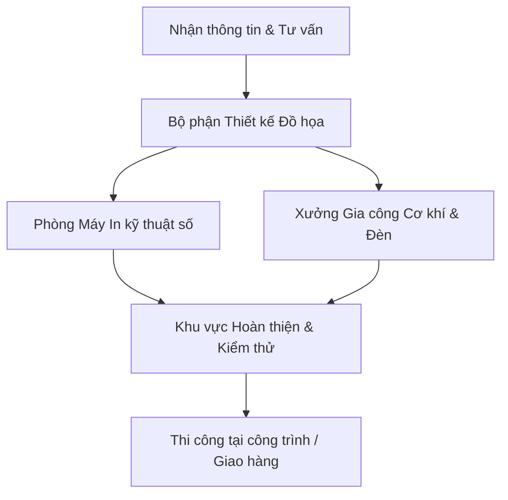

# Nghiên Cứu Ngành Nghề và Sản Phẩm: In Ấn Quảng Cáo Tân Thành

Tài liệu này tổng hợp thông tin nghiên cứu về ngành nghề in ấn - quảng cáo, các mặt hàng phổ biến, cấu trúc của một cơ sở sản xuất quảng cáo tiêu chuẩn, và định hướng phát triển trang web front-end cho **In ấn Quảng cáo Tân Thành** tại **129 Thạch Lam**.

---

## 1. Tổng Quan Ngành Nghề In Ấn & Quảng Cáo

Ngành **In ấn và Thiết kế Quảng cáo** tại Việt Nam (đặc biệt là khu vực sầm uất như đường Thạch Lam, Quận Tân Phú, TP. HCM) đóng vai trò cốt lõi trong việc định vị và nhận diện thương hiệu cho các hộ kinh doanh, cửa hàng, doanh nghiệp vừa và nhỏ (SMEs).

### Đặc trưng ngành nghề:
- **Tính tùy biến cao (Customization):** Mỗi sản phẩm (bảng hiệu, tem nhãn, băng rôn) đều được thiết kế độc bản theo yêu cầu và bộ nhận diện thương hiệu riêng của khách hàng.
- **Kết hợp đa lĩnh vực:** Đòi hỏi sự kết hợp giữa **thiết kế mỹ thuật**, **công nghệ in ấn kỹ thuật số**, và **gia công cơ khí - điện tử** (hàn khung, lắp đèn LED, thi công mặt dựng).
- **Yếu tố tốc độ:** Khách hàng thường yêu cầu thời gian hoàn thành nhanh (in lấy liền đối với ấn phẩm nhỏ, thi công trong vài ngày đối với bảng hiệu lớn).

---

## 2. Các Phân Nhóm Mặt Hàng & Dịch Vụ Chủ Đạo

Dưới đây là các mặt hàng và dịch vụ phổ biến nhất mà một cơ sở in ấn quảng cáo chuyên nghiệp như Tân Thành cung cấp:

### A. Thi Công Bảng Hiệu & Mặt Dựng Quảng Cáo (Signboard)
*Đây là mảng dịch vụ mang lại doanh thu lớn và định hình uy tín cho cơ sở.*
- **Bảng hiệu Alu chữ nổi:** Sử dụng tấm Aluminium làm nền, chữ nổi bằng Mica hoặc Inox tích hợp đèn LED phát sáng. mang lại vẻ ngoài cao cấp, bền bỉ ngoài trời.
- **Bảng hiệu hộp đèn (Lightbox):** Hộp đèn bạt Hiflex (bình dân), hộp đèn Mica hút nổi (hiện đại), hộp đèn LED siêu mỏng (sang trọng cho showroom).
- **Bảng LED vẫy & LED Ma Trận (Matrix):** Tạo hiệu ứng nhấp nháy thu hút sự chú ý vào ban đêm, dễ dàng thay đổi nội dung chữ chạy.
- **Bảng hiệu tôn sóng / gỗ vintage:** Xu hướng mới dành cho các quán cafe, tiệm thời trang chuộng phong cách retro/mộc mạc.

### B. In Ấn Kỹ Thuật Số Khổ Lớn (Large Format Printing)
*Phục vụ cho các chương trình khuyến mãi, sự kiện ngắn hạn hoặc trang trí.*
- **In bạt Hiflex:** Làm băng rôn treo đường phố, backdrop sự kiện, bảng hiệu giá rẻ.
- **In PP (PP trong nhà / ngoài trời):** Bề mặt mịn, sắc nét hơn Hiflex, thường dùng làm standee, tranh treo tường, poster quảng cáo.
- **In PP cán Format (Formex):** Dán tấm PP lên tấm xốp cứng Format để làm bảng thông tin, menu đứng, các mô hình/mockup sản phẩm.

### C. Tem Nhãn, Decal & Ấn Phẩm Văn Phòng (Label & Stationery)
*Phục vụ các shop bán hàng online, quán trà sữa, cafe, văn phòng.*
- **In Decal các loại:** Decal trong (dán ly thủy tinh, cửa kính), decal sữa (dán chai lọ), decal mờ/decal lưới (dán vách kính văn phòng).
- **Tem nhãn sản phẩm:** Tem bảo hành (tem vỡ), tem nhãn decal giấy/nhựa bế hình theo yêu cầu.
- **Ấn phẩm văn phòng:** Danh thiếp (Namecard), tờ rơi (Flyers), Catalogue giới thiệu sản phẩm, hóa đơn bán lẻ.

### D. Gia Công Kỹ Thuật Số (Processing)
- Cắt khắc Laser/CNC trên Mica, gỗ, Formex làm chữ nổi, vách ngăn trang trí.
- Gia công uốn chân chữ nổi tự động.

---

## 3. Cấu Trúc Cơ Sở Sản Xuất Tiêu Chuẩn

Để vận hành hiệu quả tại địa chỉ **129 Thạch Lam**, cơ sở Tân Thành dự kiến sẽ bao gồm các phân khu chức năng:

1. **Văn phòng giao dịch & Thiết kế:** Nơi tiếp khách hàng, trưng bày các mẫu chất liệu (Mica, Alu, các loại đèn LED) và bàn làm việc của các Graphic Designer.
2. **Khu vực máy in (Phòng lạnh/kín bụi):** Chứa máy in bạt khổ lớn, máy in PP, máy cắt bế decal để đảm bảo chất lượng bản in sạch, không bám bụi.
3. **Xưởng gia công cơ khí:** Nơi hàn khung sắt bảng hiệu, cắt Alu, uốn nổi chữ Mica/Inox và lắp đặt hệ thống nguồn điện, đèn LED.
4. **Đội ngũ thi công ngoài trời:** Chuyên chở và lắp đặt bảng hiệu trực tiếp tại mặt bằng của khách hàng.

---

## 4. Định Hướng Phát Triển Web Front-End cho Quảng Cáo Tân Thành

Từ các phân tích trên, trang web giới thiệu sản phẩm cần tập trung vào **hình ảnh thực tế trực quan**, **quy trình làm việc chuyên nghiệp**, và **khả năng tương tác nhanh**.

### Các trang chính cần thiết kế:
1. **Trang chủ (Home):** Banner động ấn tượng giới thiệu các công trình tiêu biểu, các dịch vụ nổi bật, địa chỉ 129 Thạch Lam rõ ràng kèm bản đồ.
2. **Danh mục dịch vụ/sản phẩm (Services/Products):** Chia làm các nhóm trực quan (Bảng Hiệu, In Ấn Khổ Lớn, Tem Nhãn - Decal, Led & CNC).
3. **Thư viện dự án (Portfolio):** Slide/Grid hình ảnh các công trình thực tế đã thi công (hình trước/sau khi lên đèn ban đêm).
4. **Báo giá & Tư vấn (Pricing & Contact):** Form đăng ký tư vấn nhanh, công cụ tính giá sơ bộ dựa trên kích thước và chất liệu (tăng tính tương tác).

### Phong cách thiết kế đề xuất (Design System):
- **Tone màu chủ đạo:** Sử dụng các màu sắc hiện đại, năng động như Xanh neon/Cam rực rỡ kết hợp với nền Dark Mode huyền bí để làm nổi bật các hiệu ứng ánh sáng (giả lập hiệu ứng đèn LED bảng hiệu ban đêm).
- **Hiệu ứng động (Micro-animations):** Hiệu ứng hover phát sáng (glow) như đèn neon, chuyển trang mượt mà, carousel hình ảnh sản phẩm chất lượng cao.
